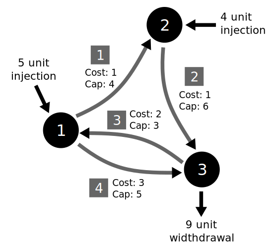

# MinCostFlows

[](https://travis-ci.org/NREL/MinCostFlows.jl)
[](https://coveralls.io/github/NREL/MinCostFlows.jl?branch=master)

Efficiently solves min-cost network flow problems using the Relaxation
dual ascent method of Bertsekas (1985), including support for parameter
updates and warm-started re-solves.

Min cost flow problems involve networks with flow injections at nodes,
and flow costs and limits on edges. A min cost flow solver identifies a
least-cost set of flows that satisfy both the edge flow constaints and
flow balance constraints at every node.

In this implementation, all edges have an implicit minimum flow of zero,
however edges can be defined in both directions between nodes. All
parameters must be integers.

# Usage

Consider the following min-cost flow problem, with three nodes and four
edges:

[](example.svg)

The network can be encoded as a min cost flow problem as follows:

```julia
using MinCostFlows

# Node properties
injection = [5, 4, -9]

# Edge properties
nodefrom = [1, 2, 3, 1]
nodeto = [2, 3, 1, 3]
limit = [4, 6, 3, 5]
cost = [1, 1, 2, 3]

fp = FlowProblem(nodefrom, nodeto, limit, cost, injection)
```

With the problem defined, it can be solved and the solution obtained with:

```julia
solveflows!(fp)
solution = flows(fp) # [2, 6, 0, 3]
```

In this case, all of node 2's 4-unit injection flows to node 3 via edge 2.
As much of node 1's injection as possible (two units) flows through edges
1 and 2 (at a cost of 1+1=2 per unit), until edge 2's capacity is reached.
The remaining three units flow from node 1 through edge 3 at a cost of 3
per unit.

The network parameters (injections, costs, and limits) can also be changed
in-place and the problem re-solved using the previous solution as a
starting point. Depending on the size and nature of the network, this can
be substantially faster than solving the problem from scratch.

```julia
# Set node 2 injection to zero, automatically adjusting withdrawal at
# node 3 to maintain flow feasibility
updateinjection!(fp.nodes[2], fp.nodes[3], 0)
solveflows!(fp)
flows(fp) # [4, 4, 0, 1]

# Reduce the cost of flows on edge 4, and increase its capacity
updateflowcost!(fp.edges[4], 1)
updateflowlimit!(fp.edges[4], 5)
solveflows!(fp)
flows(fp) # [0, 0, 0, 5]
```
